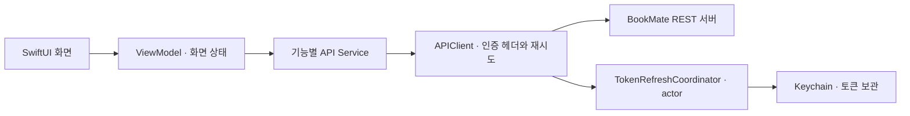

# 북메이트 · BookMate

**책에서 만난 단어와 문장을, 그 책에 연결해 다시 꺼내보는 iOS 독서 기록 앱.**

단어 뜻만 저장하면 어느 책에서 어떤 문맥으로 만났는지 놓치기 쉬움. 북메이트는 단어·문장·메모를 책 단위로 모아, 뜻을 찾는 순간부터 독서 기록까지 연결.

[서비스 소개](https://bookmate.kr) · [실행 방법](docs/setup.md)

## 주요 기능

| 사용 상황 | 기능 |
| --- | --- |
| 읽다가 모르는 단어를 만났을 때 | 사전 검색 후 뜻과 책 속 문장을 해당 책에 저장 |
| 읽을 책을 기록할 때 | 도서 검색·직접 등록, 쪽수 조회, 독서 상태·기간·진행률 관리 |
| 남긴 기록을 다시 찾을 때 | 책별 단어·문장·메모·리뷰 조회, 저장 기록 검색과 필터 |
| 내 독서 공간을 정리할 때 | 책장 순서 변경, 미니룸 테마 설정 |
| 다른 사람의 독서를 둘러볼 때 | 공개 책장·리뷰 조회, 방명록 작성, 신고·차단 |
| 독서를 이어가고 싶을 때 | 독서 리마인더, 방명록 푸시와 알림함, 해당 방명록으로 이동 |

## 문제를 해결한 과정

### 1. 방명록 전송 후, 응답을 기다려야 글이 보이는 문제

- **판단**: 저장 완료 시간과 사용자가 전송을 확인하는 시점을 분리. 빠르게 반응하되 전송 중 상태와 실패 여부는 구분할 필요.
- **처리**: 임시 글을 먼저 표시하고 `전송 중...` 안내. 성공하면 서버 응답으로 교체, 실패하면 임시 글 삭제 후 전송한 내용 복구.
- **확인 범위**: 화면 상태 갱신·API 호출·전체 처리에 `os_signpost` 추가. 전후 측정값은 아직 없어 개선율은 미기재.

[상태 전환과 측정 기준](docs/guestbook-send-performance.md)

### 2. 토큰 만료를 곧바로 로그아웃으로 처리하는 문제

- **판단**: 만료된 access token은 갱신을 먼저 시도. 여러 요청이 동시에 401을 받아도 refresh token을 중복 사용하지 않도록 요청 조율 필요.
- **처리**: `actor`에서 진행 중인 갱신 `Task` 공유. 이미 교체된 토큰은 재사용하고, 원래 요청은 새 토큰으로 한 번만 재시도.
- **결과**: 공통 `APIClient`에 갱신을 모아 각 서비스에서 따로 처리할 필요를 줄임. access token과 refresh token은 Keychain에 보관.

[동시 요청 처리와 재시도 범위](docs/token-refresh.md)

### 3. 단어를 저장하려는데, 연결할 책이 없는 문제

- **판단**: 책 등록을 마친 뒤 같은 단어를 다시 검색하게 하면 기록 흐름이 끊김. 검색 결과와 돌아갈 목적지를 유지할 필요.
- **처리**: 단어 저장 시트에서 책 등록으로 이동, 완료 후 기존 검색 결과로 저장 시트 재개. 방금 등록한 책을 우선 선택.
- **결과**: `단어 검색 → 책 등록 → 같은 단어 저장`을 한 흐름으로 연결. 취소하거나 책장으로 이동하면 재개 상태 정리.

[화면 전환 중 유지할 상태와 한계](docs/word-save-registration-flow.md)

## 구현 구조

이 저장소는 iOS 클라이언트 코드. 회원 인증과 독서 기록 저장은 별도 REST 서버와 연동.

| 기술 | 사용 목적 |
| --- | --- |
| SwiftUI · Combine | 화면 구성, `ObservableObject`와 `@Published`로 상태 반영 |
| Swift Concurrency | `async/await` 네트워크 요청, `@MainActor` 화면 상태 관리, `actor` 토큰 갱신 조율 |
| URLSession · Codable | REST 요청과 응답 모델 변환 |
| Keychain · AuthenticationServices · Kakao SDK | 토큰 보관, Apple·카카오 로그인 연동 |
| Firebase Analytics · Crashlytics · Messaging | 사용 이벤트, 크래시 수집, 푸시 알림 |
| Kingfisher · UserNotifications · os_signpost | 이미지 로딩·캐시, 로컬 알림, 처리 구간 측정 |

`BookMateViewModel`은 책·단어·문장·메모·리뷰 기능을 extension 파일로 구분. 인증은 `AuthSessionViewModel`, 네트워크 요청은 `Services/`에서 관리. 일부 화면은 서비스를 직접 호출하는 구조.

## 실행 및 검증

- iOS 26.2 이상, 해당 SDK를 지원하는 Xcode 필요. Swift 언어 모드는 5.0.
- 본인 개발 환경의 API 설정과 Firebase 구성 필요. [설정 순서](docs/setup.md) 참고.
- 현재 XCTest 타깃은 기본 템플릿 수준. 위 사례의 기능 회귀 테스트와 실기기 성능 측정은 보완 항목이며, 각 상세 문서에 확인 시나리오 정리.
