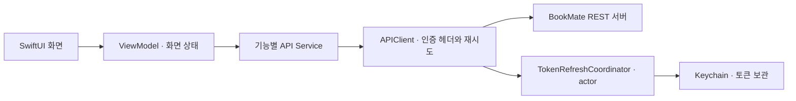

# 북메이트 · BookMate

**책에서 만난 단어와 문장을, 그 책에 연결해 다시 꺼내보는 iOS 독서 기록 앱.**

단어 뜻만 저장하면 어느 책에서 어떤 문맥으로 만났는지 놓치기 쉬움. 북메이트는 단어·문장·메모를 책 단위로 모아, 뜻을 찾는 순간부터 독서 기록까지 연결.

[서비스 소개](https://bookmate.kr) · [서버 코드](https://github.com/cozyrim/bookmate-server) · [실행 방법](docs/setup.md)

## 주요 기능

| 사용 상황 | 기능 |
| --- | --- |
| 읽다가 모르는 단어를 만났을 때 | 사전 검색 후 뜻과 책 속 문장을 해당 책에 저장 |
| 읽을 책을 기록할 때 | 도서 검색·직접 등록, 쪽수 조회, 독서 상태·기간·진행률 관리 |
| 남긴 기록을 다시 찾을 때 | 책별 단어·문장·메모·리뷰 조회, 저장 기록 검색과 필터 |
| 내 독서 공간을 정리할 때 | 책장 순서 변경, 미니룸 테마 설정 |
| 다른 사람의 독서를 둘러볼 때 | 공개 책장·리뷰 조회, 방명록 작성, 신고·차단 |
| 독서를 이어가고 싶을 때 | 독서 리마인더, 방명록 푸시와 알림함, 해당 방명록으로 이동 |

## 문제를 해결한 과정

### 1. 서재 탭 전환과 책장 스크롤이 끊기는 문제

- **판단**: Instruments로 화면 계산·메모리·Hitch를 함께 확인하고, 서재의 관찰 범위와 View 구조를 우선 개선.
- **해결 과정**: 책 데이터만 구독하도록 분리하고, `LazyHStack` 페이징·단일 페이지 분기 적용. 당시 책 제목 View 단순화와 배경 에셋 경량화도 함께 진행.
- **결과 및 배운 점**: 개선 당시 Hitch 총 지속 시간 **4.42초 → 483.93ms, 89.1% 감소**. 필요한 상태만 관찰하고, 같은 사용자 동작으로 전후를 비교하는 기준 정립.

[전후 수치·측정 조건·현재 코드와의 차이](docs/miniroom-rendering-performance.md)

### 2. 방명록 전송 후, 응답을 기다려야 글이 보이는 문제

- **판단**: 저장 완료 시간과 사용자가 전송을 확인하는 시점을 분리. 평균과 함께 p95를 확인해 느린 요청도 개선 대상으로 선정.
- **해결 과정**: 임시 글과 `전송 중...` 안내를 먼저 표시하고, 실패 시 입력 복구. 서버에서는 FCM 발송을 저장 커밋 후 비동기로 분리.
- **결과 및 배운 점**: 전후 각각 22회 측정에서 API 구간 p95 **1,280ms → 235.52ms, 81.6% 감소**. 빠른 화면 반응과 저장 성공은 구분하고, 실패 복구까지 설계할 필요 확인.

[상태 전환과 전후 측정값](docs/guestbook-send-performance.md)

### 3. 토큰이 만료되면 바로 로그아웃되는 문제

- **판단**: 갱신 가능한 만료는 먼저 복구. 여러 요청이 동시에 401을 받아도 refresh token을 중복 사용하지 않도록 조율 필요.
- **해결 과정**: `actor`에서 진행 중인 갱신 `Task` 공유. 이미 교체된 토큰은 재사용하고, 원래 요청은 새 토큰으로 한 번만 재시도.
- **결과 및 배운 점**: 공통 `APIClient`로 갱신 흐름 통합. `actor`의 상태 보호와 네트워크 대기 중 작업 중복 방지는 별개이므로, 진행 중인 `Task` 공유가 필요함을 확인.

[갱신 순서와 재시도 범위](docs/token-refresh.md)

### 4. 단어를 저장하려는데, 연결할 책이 없는 문제

- **판단**: 책 등록 후 같은 단어를 다시 검색하면 기록 흐름이 끊김. 검색 결과와 돌아갈 목적지를 유지할 필요.
- **해결 과정**: 단어 저장 시트에서 책 등록으로 이동, 완료 후 기존 검색 결과로 저장 시트 재개. 방금 등록한 책을 우선 선택.
- **결과 및 배운 점**: `단어 검색 → 책 등록 → 같은 단어 저장`을 한 흐름으로 연결. 화면 이동보다 사용자가 끝내려던 작업을 기준으로 보존·재개·취소 상태를 설계.

[화면 전환 중 유지할 상태와 한계](docs/word-save-registration-flow.md)

수치는 당시 실기기 개발 기록 기준. 미니룸은 동일 시나리오 전후 한 쌍, 방명록은 전후 각각 22회 측정 결과이며 최신 버전의 재측정값은 아님. 조건과 해석 범위는 각 문서에 정리.

## 구현 구조

이 저장소는 iOS 클라이언트 코드. 회원 인증과 독서 기록 저장은 별도 REST 서버와 연동.

| 기술 | 사용 목적 |
| --- | --- |
| SwiftUI · Combine | 화면 구성, `ObservableObject`와 `@Published`로 상태 반영 |
| Swift Concurrency | `async/await` 네트워크 요청, `@MainActor` 화면 상태 관리, `actor` 토큰 갱신 조율 |
| URLSession · Codable | REST 요청과 응답 모델 변환 |
| Keychain · AuthenticationServices · Kakao SDK | 토큰 보관, Apple·카카오 로그인 연동 |
| Firebase Analytics · Crashlytics · Messaging | 사용 이벤트, 크래시 수집, 푸시 알림 |
| Kingfisher · UserNotifications · os_signpost | 이미지 로딩·캐시, 로컬 알림, 처리 구간 측정 |

`BookMateViewModel`은 책·단어·문장·메모·리뷰 기능을 extension 파일로 구분. 인증은 `AuthSessionViewModel`, 네트워크 요청은 `Services/`에서 관리. 일부 화면은 서비스를 직접 호출하는 구조.

## 실행 및 검증

- iOS 26.2 이상, 해당 SDK를 지원하는 Xcode 필요. Swift 언어 모드는 5.0.
- 본인 개발 환경의 API 설정과 Firebase 구성 필요. [설정 순서](docs/setup.md) 참고.
- 현재 XCTest 타깃은 기본 템플릿 수준. 위 사례의 기능 회귀 테스트와 최신 버전의 실기기 성능 재측정은 보완 항목이며, 각 상세 문서에 확인 시나리오 정리.
