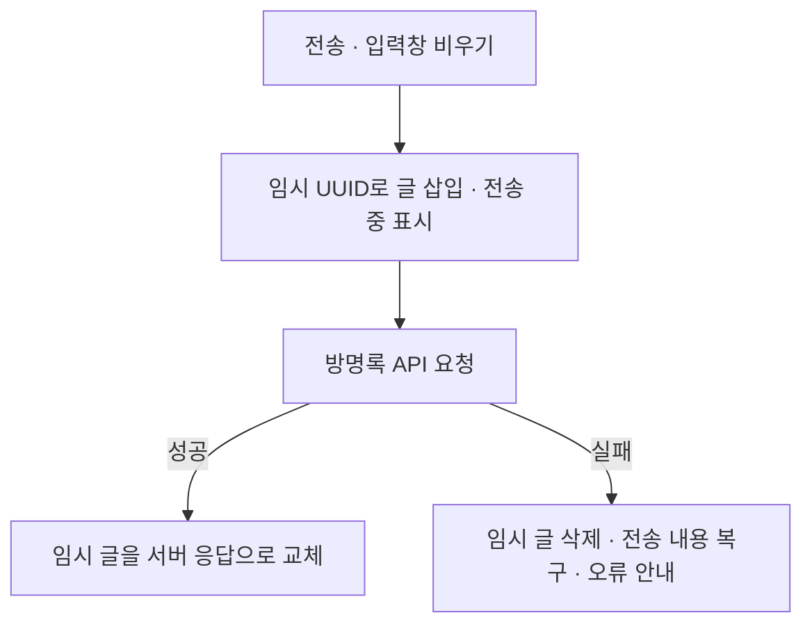

# 방명록 전송 후 화면 반응 개선

## 문제와 판단

방명록 전송 후 서버 응답까지 기다려야 작성한 글이 목록에 표시되는 흐름. 네트워크가 느리면 사용자는 버튼이 동작했는지 바로 확인하기 어려움.

저장 완료와 화면 반응을 분리하는 방식 선택. 글은 먼저 보여주되 서버에 저장됐다고 오해하지 않도록 전송 중 상태 표시. 실패했을 때 다시 입력할 부담도 줄일 필요.

## 해결 과정

- `pendingMessageIDs`로 임시 글과 저장된 글 구분. 전송 중 글에는 삭제·신고 등 후속 동작을 표시하지 않음.
- `isPosting`으로 응답을 기다리는 동안 전송 버튼 비활성화.
- 성공 시 임시 UUID의 위치를 찾아 서버 응답으로 교체. 별도 목록 재조회 없이 저장된 글 반영.
- 실패 시 임시 글과 pending 상태 제거. 작성 컴포넌트가 전송했던 내용을 입력창에 복구.
- 입력 상태는 `GuestbookComposerView` 내부 `@State`로 관리.

관련 코드: [GuestbookSheetView.swift](../BookMate/Social/GuestbookSheetView.swift)의 `postMessage`, `replaceOptimisticMessage`, `GuestbookComposerView`.

## 서버 응답에서 분리한 작업

별도 `bookmate-server`의 방명록 저장 흐름도 함께 정리. 기존 개발 기록은 저장 요청 안에서 FCM 발송까지 기다리는 구조였으며, 현재 서버 코드는 트랜잭션 커밋 후 `@Async` 메서드에 푸시 발송을 넘기는 방식.

- 방명록 저장 응답이 외부 FCM 발송 완료까지 기다리지 않도록 분리.
- 커밋 후 발송을 요청해 저장에 실패한 글의 알림이 나가는 상황 방지.
- 비동기 작업은 영속 큐가 아니므로 프로세스 종료 시 전달 보장과 재시도 정책은 별도 보완 필요.

이 부분은 iOS 화면의 낙관적 갱신과 구분되는 서버 변경. 이 저장소에는 서버 구현을 포함하지 않으며, 위 설명은 기존 개발 기록과 별도 서버의 `GuestbookService`, `PushNotificationService` 구현을 대조한 내용.

## 측정 기준

화면 상태를 먼저 바꾸는 처리와 서버 호출을 구분해 확인하도록 [PerformanceLogger.swift](../BookMate/Utils/PerformanceLogger.swift)에 `os_signpost` 사용.

| 구간 | 현재 코드가 측정하는 범위 |
| --- | --- |
| `PostGuestbookOptimisticUI` | pending ID 추가와 배열 삽입. 실제 화면 렌더링 완료 시점은 포함하지 않음 |
| `PostGuestbookAPI` | 서비스 호출 시작부터 응답 교체 또는 오류 처리까지. 순수 서버 처리 시간과는 차이 있음 |
| `PostGuestbookTotal` | 전송 처리 시작부터 성공·실패 처리와 전송 상태 정리까지 |

## 결과 및 배운 점

노션 「방명록 전송버튼 개선」의 실기기 `os_signpost` 기록을 확인해 전후 수치 반영. 원문에 기재된 조건은 동일 네트워크·전후 각각 22회 전송·첫 화면 진입 후 실제 사용 흐름. 기기 모델·OS·빌드 설정·개별 샘플은 문서에서 확인되지 않아 백분위수를 새로 산출하지 않고 기록된 집계값 사용.

| API 구간 지표 | 개선 전 | 개선 후 | 감소율 |
| --- | ---: | ---: | ---: |
| 평균 | 842ms | 158.63ms | 81.2% |
| p50 | 735ms | 141.20ms | 80.8% |
| p95 | 1,280ms | 235.52ms | 81.6% |
| 최대 | 2,310ms | 401.28ms | 82.6% |

감소율은 `(개선 전 − 개선 후) ÷ 개선 전 × 100`으로 계산해 소수 첫째 자리 반올림. 원문의 요약 문장에 쓰인 159ms·236ms 대신 상세 표의 API 구간 값으로 계산.

- 개선 후 `PostGuestbookOptimisticUI` p50은 **68.84µs**. 배열 삽입 등 상태 변경 구간이며, 실제 화면 렌더링 완료까지 걸린 시간은 아님.
- 개선 후 `PostGuestbookTotal` p50은 **141.80ms**, p95는 **236.08ms**. API 구간 수치와 구분.
- iOS 낙관적 갱신과 서버 FCM 비동기화를 함께 적용한 결과. 서버 단독 실행 시간이나 개별 변경의 기여율로 해석하지 않음.
- 평균뿐 아니라 p95를 함께 봐야 일부 느린 요청을 놓치지 않음. 빠른 반응을 제공하더라도 저장 확정 여부와 실패 복구는 따로 설계해야 함.

근거: 개인 노션 「방명록 전송버튼 개선」의 개선 전·후 표와 옵시디언의 같은 사례를 2026-09-22 대조. 이번 문서 수정에서 앱을 재측정한 것은 아님.

## 확인할 시나리오

아래는 검증 계획이며 자동화 테스트 통과 기록은 아님.

| 조건 | 확인할 동작 |
| --- | --- |
| 느린 네트워크에서 전송 | 응답 전에 임시 글 표시, 전송 중 안내, 중복 전송 차단 |
| 정상 응답 | 임시 글 하나가 실제 글 하나로 교체 |
| 서버 오류·연결 끊김 | 임시 글 제거, 전송한 내용 복구, 실패 안내 |
| 전송 대기 중 다른 내용 입력 후 실패 | 기존 복구 로직이 새 입력을 덮어쓰는지 확인 |

현재 실패 복구는 `draft = content`로 전송했던 내용을 대입하므로, 대기 중 새로 입력한 내용 보존은 보완 필요. 타임아웃 전에 서버 저장이 끝난 경우 재전송 중복 여부는 서버의 멱등성 처리까지 확인해야 함.

후속 성능 비교 시 같은 실기기·네트워크·빌드 조건에서 전후 각각 20회 이상 반복하고 첫 1–2회는 워밍업으로 제외. `p50`, `p95`, `max`, `avg` 기록. 실제 화면 표시 시점은 Instruments의 화면 갱신 구간과 함께 확인.

[README로 돌아가기](../README.md)
